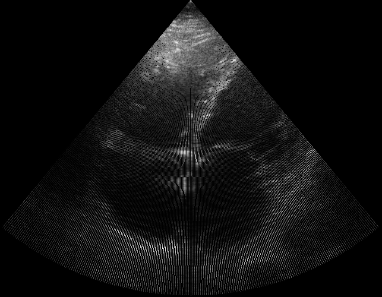
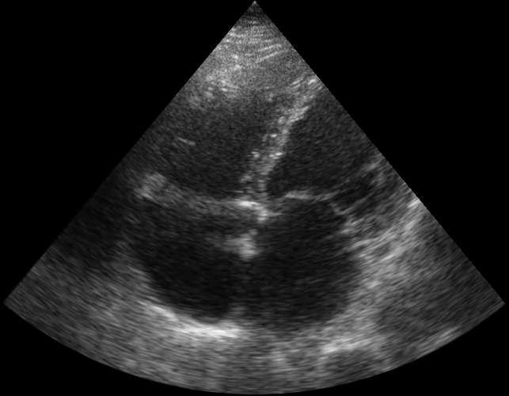

# DICOMatic

This was a tool used to generate cardiac heart loops by dumping the JPEG 2000 files from the DICOM and reassembling them into MP4s without needing to actually understand the DICOM format, or deal with the typcial problems of text or overlays I was not interested in. The JPEG 2000 files are actually the beamspace data, so you need to scanconvert them and interpolate to reconstruct the typical sector image

## Conversion sample
### Beamspace image

### Scan-converted image

### Interpolated image

